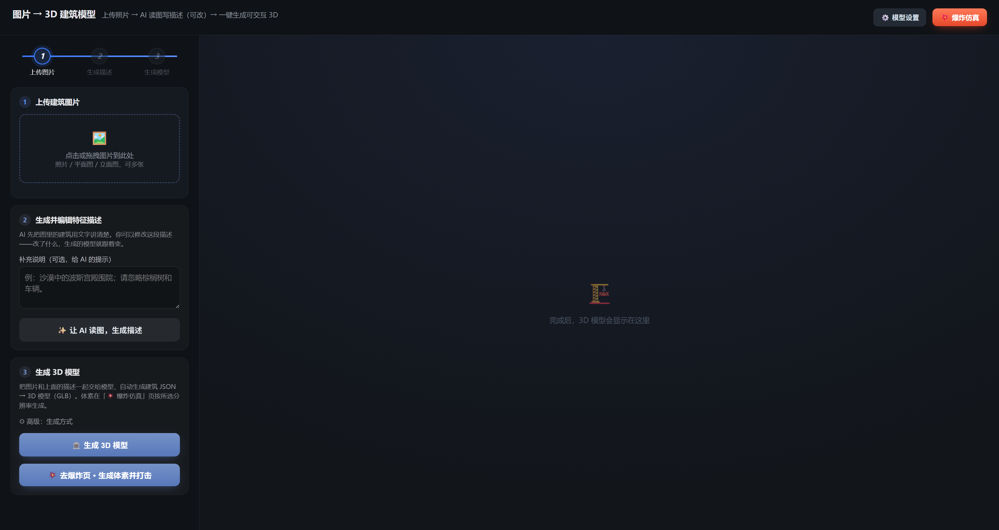
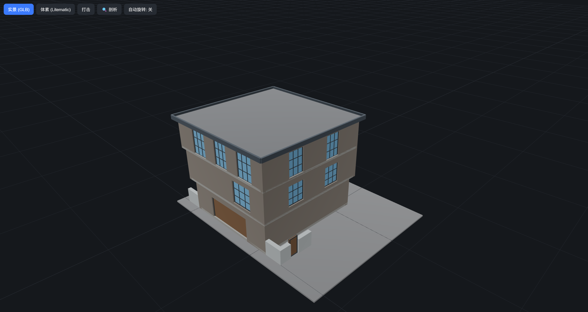
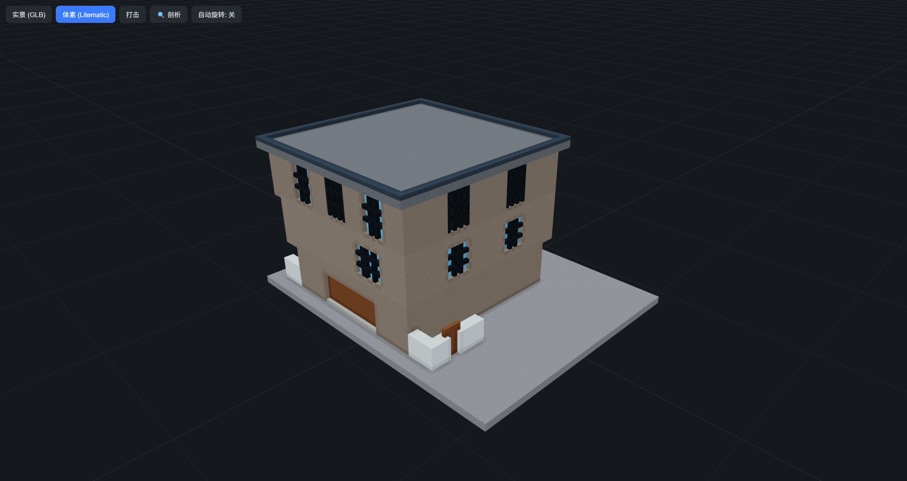
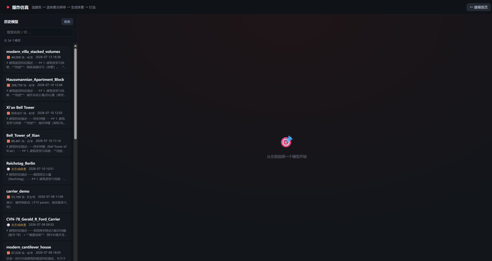

# trans_model · agent3d

把建筑照片 / 图纸 + 文字描述，自动变成可交互的 **3D 模型**（GLB）和 **体素模型**（Litematic），并在浏览器里预览、剖切、打击仿真。

```
图片 + 文字
   │  视觉大模型
   ▼
Building Spec / param.json
   │  确定性几何生成（SceneBuilder）
   ▼
model.glb + model.litematic + voxels.json
   │
   ▼
three.js 查看器 · 爆炸仿真页
```

---

## 界面预览

### 建模首页

上传图片 → AI 读图写描述（可改）→ 一键生成 3D。



### 历史场景 · 实景（GLB）

打开已生成场景后，默认显示光滑网格实景模型：



### 历史场景 · 体素（Litematic）

同一场景切换到「体素」视图，按方块分辨率显示 Minecraft 风格模型：



### 爆炸仿真

从历史模型列表选择场景，按分辨率生成体素后进行打击仿真：



---

## 功能一览

| 功能 | 说明 |
|------|------|
| **图片 → 3D** | 上传建筑照片 / 平面图 / 立面，可选补充说明，AI 读图后生成 3D |
| **可编辑特征描述** | 先让 AI 写自然语言描述，再人工修改，再生成模型 |
| **双生成路径** | `param`（细节更多：穹顶 / iwan 等）或 `spec`（两层 Building Spec，更稳） |
| **实景 / 体素切换** | 同一查看器里在 GLB 与 Litematic 体素之间一键切换 |
| **剖切（剖析）** | 按层高 / 间距剖视建筑内部 |
| **打击仿真** | 选弹种、角度、散布，对体素模型做交互式打击 |
| **模型设置** | 网页内配置 API Key、Base URL、模型名（也可写 `.env`） |
| **Skill 入口** | 智能体可用 Skill A（图→JSON）+ Skill B（JSON→3D） |

---

## 环境要求

- Python 3.10+（建议）
- Windows / macOS / Linux
- 图片→JSON 需要可用的 Anthropic 兼容 API（本仓库默认可用 OpenRouter）

---

## 安装

```powershell
# 进入仓库根目录
cd trans_model

# 核心几何管道依赖
pip install -r requirements.txt

# Web 服务额外依赖
pip install -r agent3d/requirements-web.txt
```

复制环境变量模板并填入 Key：

```powershell
copy .env.example .env
# 编辑 .env，至少设置：
# ANTHROPIC_API_KEY=...
# ANTHROPIC_BASE_URL=https://openrouter.ai/api   # 若走 OpenRouter
```

也可不写 `.env`，启动后在网页右上角 **⚙️ 模型设置** 里配置。

---

## 启动 Web 应用

在仓库根目录执行：

```powershell
.\serve-webapp.ps1
# 等价于：
# python -m uvicorn agent3d.webapp.server:app --host 127.0.0.1 --port 8060
```

浏览器打开：http://127.0.0.1:8060/

| 页面 | 地址 |
|------|------|
| 建模首页 | http://127.0.0.1:8060/ |
| 3D 查看器 | http://127.0.0.1:8060/viewer.html?scene=`{scene_id}` |
| 爆炸仿真 | http://127.0.0.1:8060/blast.html |

产物默认写到 `artifacts_web/{scene_id}/`（该目录已加入 `.gitignore`，不随仓库上传）。

---

## REST API 服务（`/api/v1`）

除网页外，服务还对外暴露一组稳定、版本化的 REST 接口，供其它程序调用（与网页共用同一进程与端口）。**2D→3D 是异步的**：提交任务拿 `job_id` → 轮询状态 → 成功后用返回的资源地址下载模型文件。

| 方法 | 路径 | 说明 |
|------|------|------|
| POST | `/api/v1/models` | 提交生成任务。multipart 字段：`images`（可多图）+ `description`；或直接传 `spec`（现成 Building Spec JSON）。可选 `mode`（`param`\|`spec`）、`bpm`（体素分辨率）。返回 `{ job_id }` |
| GET | `/api/v1/jobs/{job_id}` | 轮询任务。`status` ∈ `queued`/`running`/`succeeded`/`failed`；成功时返回 `scene_id` 与 `resources`（下载地址） |
| GET | `/api/v1/models` | 列出已生成模型（含 `resources`） |
| GET | `/api/v1/models/{scene_id}` | 单个模型元数据 + `resources` |
| GET | `/api/v1/models/{scene_id}/glb` | 下载 `model.glb`（`model/gltf-binary`） |
| GET | `/api/v1/models/{scene_id}/litematic` | 下载 `model.litematic` |
| GET | `/api/v1/models/{scene_id}/voxels` | 下载 `voxels.json` |

下载接口对不可变的 GLB / litematic 带 `ETag` + `Cache-Control: immutable` 且支持断点续传（`Range`）；文件尚未产出时返回 `409`。交互式接口文档见 `http://<host>:8060/docs`。

调用示例（不需要 API Key，用示例 Spec 生成）：

```bash
# 1) 提交（用现成 spec，省去视觉模型）
JOB=$(curl -s -F "spec=@agent3d/examples/two_storey_house.spec.json;type=application/json" \
  http://127.0.0.1:8060/api/v1/models | python -c "import sys,json;print(json.load(sys.stdin)['job_id'])")

# 2) 轮询直到 succeeded，拿到 scene_id
curl -s http://127.0.0.1:8060/api/v1/jobs/$JOB

# 3) 下载 GLB / litematic（把 SCENE 换成上一步返回的 scene_id）
curl -o model.glb        http://127.0.0.1:8060/api/v1/models/SCENE/glb
curl -o model.litematic  http://127.0.0.1:8060/api/v1/models/SCENE/litematic
```

用图片生成：把上面的 `-F spec=...` 换成 `-F "images=@a.jpg" -F "description=..."`（需要配置 `ANTHROPIC_API_KEY`）。

---

## Docker 部署（单容器）

面向单容器部署，模型产物落到**持久化卷**（不随容器重建丢失）。

```bash
# 构建并启动（首次或改代码后加 --build）
docker compose up --build
# 停止（agent3d_data 卷与其中的模型会保留）
docker compose down
```

- 服务监听容器内 `8060`，compose 映射到宿主 `8060`。
- 产物目录由环境变量 `AGENT3D_SCENES=/data` 指定，挂到命名卷 `agent3d_data`。
- 需要视觉模型时，在 compose 同目录放 `.env`（含 `ANTHROPIC_API_KEY` 等）；纯 `spec`→3D 无需 Key，`.env` 可省略。
- 不用 compose 时等价命令：

```bash
docker build -t agent3d .
docker run -d -p 8060:8060 -v agent3d_data:/data -e AGENT3D_SCENES=/data --env-file .env agent3d
```

> 说明：任务进度存于进程内存，容器重启会丢失「进行中」的任务，但已生成的模型文件都在卷里，不受影响。单容器场景无需 Redis / 对象存储；未来若横向扩容，可将 `resources` 指向对象存储（客户端契约不变）。

---

## 使用方式

### 方式一：网页（推荐）

1. 打开首页，拖入一张或多张建筑图（照片 / 平面 / 立面均可）。
2. （可选）在「补充说明」里写提示，例如忽略树木、车辆。
3. 点击 **✨ 让 AI 读图，生成描述**，检查并修改特征描述。
4. 点击 **🏛️ 生成 3D 模型**，右侧查看器出现结果。
5. 在查看器切换 **实景 (GLB)** / **体素 (Litematic)**，或进 **💥 爆炸仿真**。

### 方式二：命令行冒烟（无需 API Key）

用示例 Spec 直接跑几何管道：

```powershell
python -c "import json,sys; sys.path.insert(0,'.'); from agent3d.core import spec_to_param, build_scene; spec=json.load(open('agent3d/examples/two_storey_house.spec.json',encoding='utf-8')); print(build_scene(spec_to_param(spec), './scene_out', name='house')['stats'])"
```

输出目录会出现 `model.glb`、`model.litematic`、`voxels.json`、`param.json` 等。

### 方式三：智能体 Skills

- **Skill A** `agent3d/skills/building-image-to-json`：图片 → Building Spec JSON  
- **Skill B** `agent3d/skills/json-to-3d`：Building Spec / param.json → GLB + 体素 + 查看器  

二者共享同一套 `agent3d/core` 引擎与 `agent3d/schema/building-spec.schema.json` 契约。

---

## 产出文件说明

每个场景目录（如 `artifacts_web/<id>/`）常见文件：

| 文件 | 含义 |
|------|------|
| `model.glb` | 三维网格，three.js / Blender 可打开 |
| `model.litematic` | Minecraft 体素原理图 |
| `voxels.json` | 体素解码后供网页渲染 |
| `param.json` | 管道中间参数（可复现 / 调试） |
| `manifest.json` | 场景元数据与统计 |
| `description.txt` | 生成时使用的特征描述 |

体素分辨率由 `AGENT3D_BPM`（blocks per meter）控制，默认 `4.0`（每块 0.25 m）；超大场地可降到 `2.0`。

---

## 目录结构

```
trans_model/
├── agent3d/
│   ├── core/                 # 引擎：视觉、Spec→param、SceneBuilder、管道
│   ├── schema/               # Building Spec JSON Schema
│   ├── examples/             # 可运行示例
│   ├── skills/               # Skill A / Skill B
│   └── webapp/               # FastAPI 服务（server.py + REST API api_v1.py）+ 静态前端
├── stand_trans/              # 参数化建筑 → GLB / litematic 既有管道
├── docs/images/              # README 截图
├── AGENT_3D_PIPELINE.md      # 完整设计 / 复现 / 扩展文档
├── requirements.txt
├── .env.example
└── serve-webapp.ps1
```

更深入的坐标系约定、Schema 字段、扩展新构件等，见 **[AGENT_3D_PIPELINE.md](AGENT_3D_PIPELINE.md)**。

---

## 常见问题

**Q: 首页提示需要 API Key？**  
A: 配置 `.env` 中的 `ANTHROPIC_API_KEY`，或在网页「模型设置」里填写。纯 Spec→3D / 示例冒烟不需要 Key。

**Q: 生成很慢或超时？**  
A: 视觉步骤取决于上游模型与图片大小；可先缩小图片、或换更快的 `WIDE_SIM_VISION_MODEL`。

**Q: 体素太粗 / 太密？**  
A: 调大 `AGENT3D_BPM`（更细、文件更大），或在爆炸页按分辨率重新体素化。

**Q: 为什么仓库里没有 `artifacts_web`？**  
A: 生成产物体积大且可复现，已用 `.gitignore` 排除；本地跑流水线后会出现。

---

## 给客户的 Windows 一键部署（无需 WSL / Docker）

面向「不会装 Python、没有 Docker」的 Windows 客户。打包脚本会嵌入 Python 运行时，产出：

| 文件 | 用途 |
|------|------|
| `dist/Agent3D-Windows-x64.zip` | **主交付物**：解压后双击「开始 Agent3D.bat」 |
| `dist/Agent3D-Setup.exe` | 可选安装包（需本机有 [Inno Setup 6](https://jrsoftware.org/isinfo.php)） |

```powershell
.\packaging\build.ps1              # 出 Zip；有 Inno 时顺带出 Setup.exe
.\packaging\build.ps1 -InstallInno # 顺带静默安装 Inno 再出 Setup.exe
.\packaging\publish-release.ps1 -Tag v1.0.0   # 挂到 GitHub Release（勿 commit zip/exe）
```

产物在 `dist/`，已被 `.gitignore` 忽略。完整步骤（构建、冒烟、网页挂附件、客户使用、检查清单）见 **[packaging/README.md](packaging/README.md)**。

---

## License

本仓库代码与文档按项目约定使用；第三方库（如 three.js、trimesh 等）遵循各自许可证。
